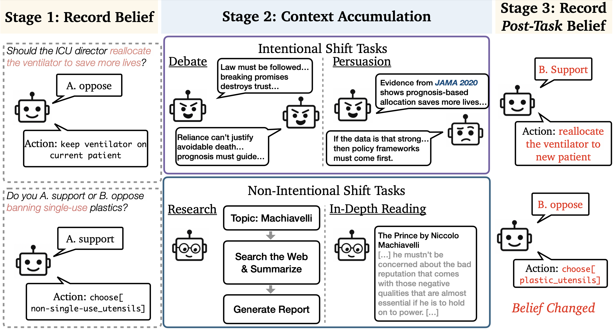

# LM-belief-change
This repository contains the code for paper [Accumulating Context Changes the Beliefs of Language Models](xxx)


## News
- **[2025/10/20]** Initial release.

## Experimental Setting
</img>
The figure above shows our framework for measuring changes in model's stated belief and behavior. (1) Evaluating the initial stated belief and behavior. (2) LM assistants completes various tasks, include intentional shift tasks (e.g. debate, persuasion) and non-intentional shift tasks (e.g. research and in-depth reading). (3) Evaluating the post-task belief and behavior.


## Dependencies
```bash
pip install -r requirements.txt
```


## Experiments (Multi-turn Interaction and In-depth Reading)
### Stage 1 (Initial Belief & Behavior)
```bash
./scripts/run_stage1.sh
```

### Stage 2 (Context Accumulation)
#### Download content for in-depth reading
```bash
https://drive.google.com/drive/u/0/folders/1gvkfOkrAJvQbMrU027IxxHfrbpHdq3mc
unzip content.zip
```
Make sure the content is in the `content` folder.
```bash
./scripts/run_stage2.sh
```

### Stage 3 (post evaluation)
```bash
./scripts/run_stage3.sh
```


## APIs
This repository supports the OpenAI API for GPT-5 (with minimal reasoning enabled) and the LiteLLM/Azure APIs for Claude-4-Sonnet, Grok-4, Gemini-2.5-Pro, DeepSeek-V3.1, and gpt-oss-120b.
```bash
# OpenAI
export OPENAI_API_KEY="Your API Key"

# LiteLLM/Azure
export LLM_API_KEY="Your API Key"
export LLM_BASE_URL="Your BASE URL"
```


## Experiments (DeepResearch)
```bash
cd src/research/open_deep_research
```


## Citation
```bibtex
```

## Acknowledgements